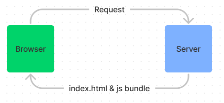

# ReactJS

Following
- the [React roadmap](https://roadmap.sh/react)
- [Intermediate React, V3 on FrontendMaster](https://frontendmasters.com/courses/intermediate-react-v3)

## Fundamental Topics

- Create React app by [a single command](https://reactjs.org/docs/create-a-new-react-app.html#create-react-app)

- JSX - stands for JavaScript extension. It allows you to “see” what the UI will look like while development. Using JSX in React, you will get a React component
    
    ```jsx
    const elem = <h1>Hello world!</h1>;
    ```

- Functional component v.s. Class component - A functional component is written shorter and simpler, which makes it easier to develop, understand, and test. Class components can also be confusing with so many uses of this. Using functional components can easily avoid this kind of mess and keep everything clean. [ref](https://www.twilio.com/blog/react-choose-functional-components)

- State v.s. props - The key difference between props and state is that state is internal and controlled by the component itself while props are external and controlled by whatever renders the component. [ref](https://stackoverflow.com/questions/27991366/what-is-the-difference-between-state-and-props-in-react#:~:text=The%20key%20difference%20between%20props,by%20whatever%20renders%20the%20component.)

    ```JavaScript
    function AddWithInput(props) {
        const [ n2, setN2 ] = React.useState(props.n2);
        // ... etc...
    }
    ```

- Conditional rendering is to render React components based on props or state. If you do not want to render a component, return `null` instead

- Component life cycle
  - In React, components go through a lifecycle of events:
    - Mounting (adding nodes to the DOM)
    - Updating (altering existing nodes in the DOM)
    - Unmounting (removing nodes from the DOM)
    - Error handling (verifying that your code works and is bug-free)
  - You can take advantage of the `useEffect` hook to achieve the same results as with the `componentWillUnmount`, `componentDidMount` and `componentDidUpdate` methods.
    - `useEffect` accepts 2 parameters. The first one is a callback which runs **after the first render and after every update**.
    - If you pass an empty array `[]` as the second argument, it tells the `useEffect` function to fire on component render (componentWillMount). This is the only time it will fire.

- Lists and keys - You can use `map` when you want to render a list of items. Each item in a list should have a unique key.

- Basic hooks
  - useState
  - useEffect

- In the old world, we need to send additional requests from browser to server in order to render a new web page. In React, React will send a JS bundle along with index.html back to the browser, so there's no need to send a new request to server just to get a new page. React will use the bundle to navigate in the client side

    

## [urql](https://formidable.com/open-source/urql/docs/) - GraphQL client in React

- Caching - By default, urql cache every unique query you send and the data you get, so you won’t overload the server. It will automaticallu

## Something Advanced ...

### [Hooks](https://reactjs.org/docs/hooks-intro.html)

#### useState

- Think it as a simple container for states
- Everytime you call the setXYZ functions returned by `useState`, it might kick off a re-rendering cycle if the state is changed

#### useEffect

- Use `useEffect` when you want to **schedule** something to happen after some conditions are fulfilled
- The first parameter doesn't expect a Promise. You can either use `.then()` or call an async function
- You can put the condition in the second parameter like below. Putting nothing makes the callback function gets executed when anything changes; empty array `[]` means the callback function will only be executed once ( = `componentDidMount`).

  ```JavaScript
  useEffect(() => {
    //...
  }, <condition>);
  ```