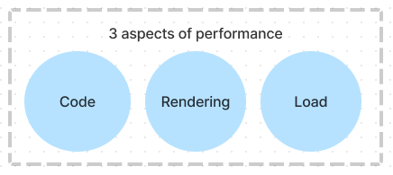
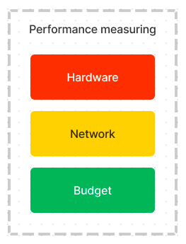

# Web Performance

- [Frontend Master course: JavaScript Performance by Steve Kinney](https://frontendmasters.com/courses/web-performance/)
- [Course notes and materials](https://gist.github.com/stevekinney/fe401ffb8b2b7279e56dd165b272f0c3)

## TODOs

- Read https://medium.com/reloading/javascript-start-up-performance-69200f43b201
- Read https://web.dev/i18n/en/why-speed-matters/

## Basics

- Think about what matters to you
- Don't tune for speed until you've **measured**
- Things to think about while measuring (TODO: create a diagram for measuring and 3 aspects below)
  - **Hardware** - Are we testing performance on fancy MacBook Pros or consumer-grade hardware?
  - **Network** - Are we simulating less-than-perfect network conditions?
  - **Budget** - What is our performance budger?

    

## JavaScript Performance

_Write code that runs faster, later, or not at all._

## Rendering Performance

_It turns out most of our JavaScript happens in the browser, which has its own performance concerns._

## Load Performance

_Until the user actually gets the page, there isn't much to optimize._

## Tools
