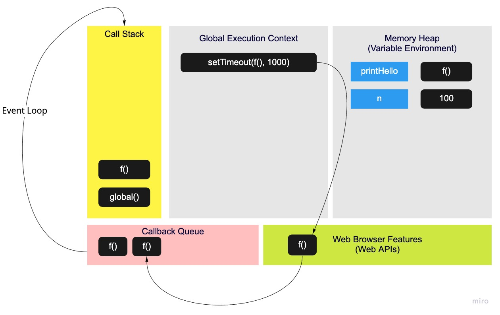

# JavaScript

* [this](https://www.freecodecamp.org/news/the-complete-guide-to-this-in-javascript/) - The `this` reference inside functions can ****be bound to**** different objects depending on where the function is being called.
* JavaScript is **single threaded (one command executing at a time) and has a synchronous** execution model (each line is executed in order the code appears)

## Asynchronous

We use web browser features to achieve asynchronous

* **setTimeout** (a fasade function for web browser feature) returns a web browser feature called Timer. When the time is up, web browser will add the function to callback queue (a.k.a. task queue)
* **Event Loop: Functions in callback queue are allowed to go back to JavaScript when the call stack is empty and all the global code is finished running**

  

* Callback queue is a JavaScript engine feature

## Promises

* `.then(func)` doesn't mean the function will be executed right away, instead it's just telling us func will be executed once the promise is fulfiled (a value is returned). i.e. It puts the function to the `onFulfilment` array of the promise

* There are 2 kinds of fasade functions, one only returns a web browser feature and another will

  1. call the web browser feature

  2. return an object (promise) that has a status (pending, resolved, rejected) and some placeholders immediately

     * value - a placeholder for what will be returned from web browser feature

     * onFulfilment - an array for functions to be executed after the value is returned

     * onRejection - an array which we can store functions using `.catch()` in

* For the second type of fasade functions, JavaScript provides another queue called `microtask queue` (a.k.a. `job queue`) to store the functions returned from web browser feature. Event loop moves functions in this microtask queue to callback stack before it moves the functions in callback queue. i.e. microtask queue is for fasade functions that return promises

* Asynchronous JavaScript is the backbone of the modern web - letting us build fast "non-blocking" applications. Promises, Web APIs, the callback & microtask queues and event loop allow us to defer our actions until the work (an API request, time etc) is completed and continue running our code line by line in the meanwhile

* A good example (TODO: animation)

  ```JavaScript
  function display(data){ console.log(data) }
  function printHello(){ console.log("Hello"); }
  function blockFor300ms(){ /* blocks js thread for 300 ms with long for loop */ }

  setTimeout(printHello, 0);
  const futureData = fetch('https://twitter.com/will/tweets/1');
  futureData.then(display);

  blockFor300ms();

  console.log("Me first!");
  ```

  1. Declare a function named display in memory
  2. Declare a function named printHello in memory
  3. Declare a function named blockFor300ms in memory
  4. Execute `setTimeout(func, 0)` , and it calls a web browser feature "Timer"
  5. On completion, `printHello` is put back to the **callback queue**. As the **call stack** is not empty, **event loop** won't move printHello from callback queue to call stack
  6. Declare a constant variable named futureData (the value is undefined at the moment) in memory
  7. Execute `futureDate('...')`, which

      a. in Javascript, returns an object (will be stored in memory as the value of futureData

      ```JaavScript
      {
        value: undefined,
        onFulfilment: []
      }
      ```

      b. in web browser, sets up a web browser feature "xhr", which sends a request to Twitter server. On completion, it assigns the returned value to the value on object futureData

  8. Store `display` function in the onFulfilment array in object futureData
  9. Execute `blockFor300ms`, which enters the call stack and sits there for 300ms. Meanwhile, Twilio returns the data and the display function is put to the **microtask queue** (As it comes from the new fasade function which does 2 things in JavaScript and web browser)
  10. Execute `console.log` and lot out "Me first!"
  11. Event loop prioritizes microtask queue over callback queue, so it moves display from microtask queue to callback stack and the display function gets executed (log out the value returned from Twitter)
  12. As microtask queue and call stack are empty, the printHello function is moved from callback queue to call stack (log out "Hello")

## Iterators

```JavaScript
function createFunction(array) {
  let i = 0;

  function inner() {
    const element = array[i];
    i++;

    return element;
  }

  return inner;
}

const returnNextElement = createFunction([4, 5, 6]);
const element1 = returnNextElement();
const element2 = returnNextElement();
```

In this example, when we return the function and store it in memory as the value of `returnNextElement`, it takes a **backpack of persistent data** (`array` and `i`) with it

## Generators
